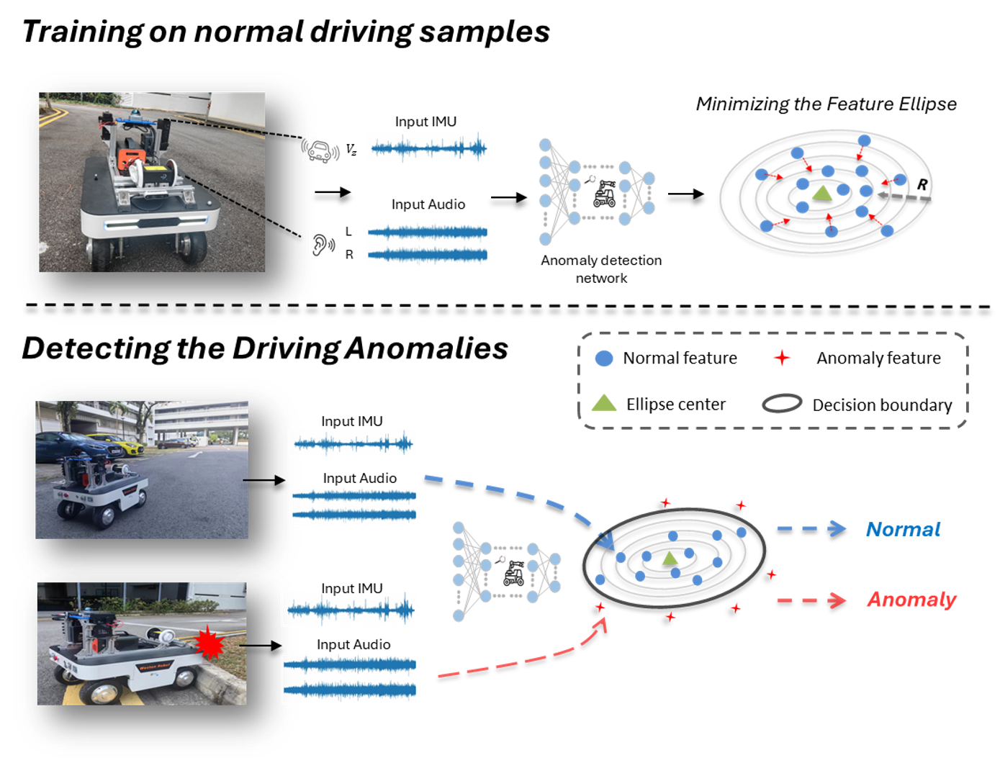
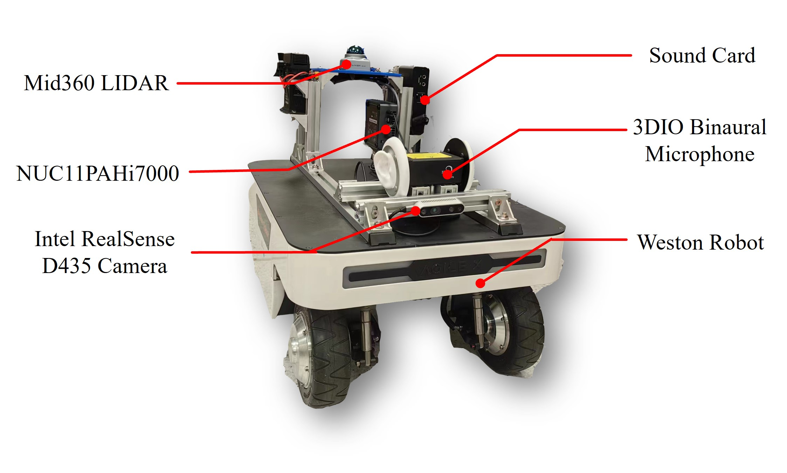

# Audio-Inertia Fusion for Anomaly Detection in Autonomous Mobile Robots Based on Gaussian SVDD  

This repository contains the implementation of our proposed unsupervised anomaly detection network that fuses **audio** and **IMU data** to detect anomalies, including **collisions** and **component failures**.  

Our approach leverages a **Gaussian-based Deep Support Vector Data Description (GSVDD)** model trained solely on **normal operational data**, enabling cost-effective and robust anomaly detection **without the need for annotated fault datasets**.  

---

## The structure of the proposed network 
<div style="display: flex; justify-content: center; align-items: center; gap: 60px;">
    
    
</div>


---
## Preparation

### Environment Setup
To ensure compatibility and smooth execution, the following libraries and frameworks are required:
- **PyTorch**
- **TorchAudio**
- **DeepOD**

### Dataset
The dataset used in this work was collected from the platform illustrated in the figure below. 
It can be downloaded from the following link:[Insert download link here]

---
## Train and Validatation

### Set the Configuration  
Edit the configuration file located at: `config/config.json`  

### Train the Network  
Run the following command to train the model:  
```bash
python GSVDD_train.py
```  

### Evaluate the Network  
After training, evaluate the model's performance using:`GSVDD_test.ipynb`  

---

## Note
The evaluation of the model on public datasets are presented in timeseries branch.

___

## References  
- **TranAD**: [TranAD Repository](https://github.com/imperial-qore/TranAD)  
- **DeepOD**: [DeepOD Repository](https://github.com/xuhongzuo/DeepOD)  
---