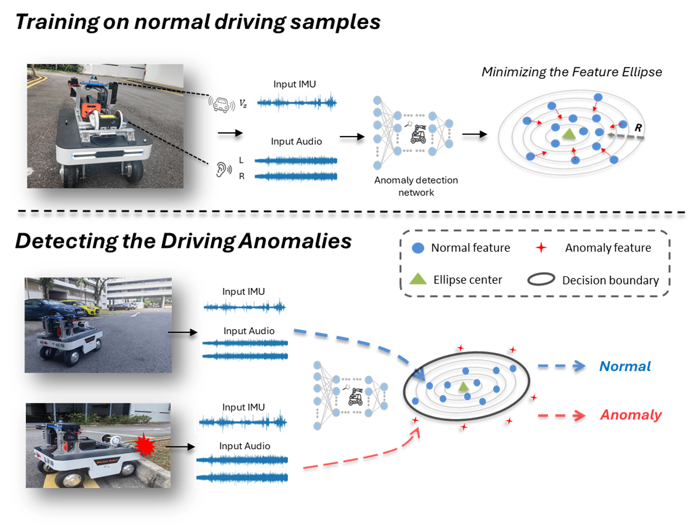
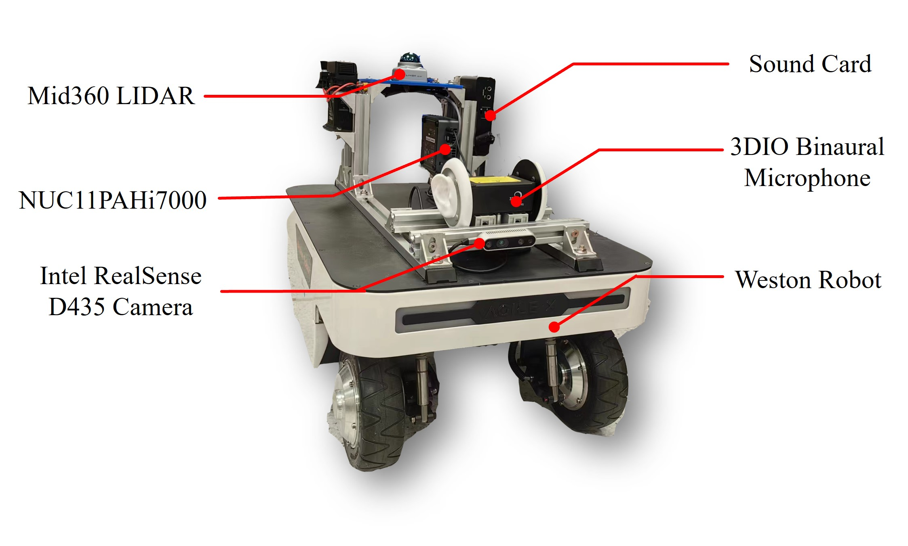

# Audio-Inertia Fusion for Anomaly Detection in Autonomous Mobile Robots Based on Mahalanobis SVDD  

---

## The structure of the proposed network 
<div style="display: flex; justify-content: center; align-items: center; gap: 200px;">
    
    
</div>


---
## Preparation

### Environment Setup
To ensure compatibility and smooth execution, the following libraries and frameworks are required:
- **PyTorch**
- **TorchAudio**
- **DeepOD**


---
## Train and Validatation

### Set the Configuration  
Edit the configuration file located at: `config/config.json`  

### Train the Network  
Run the following command to train the model:  
```bash
python MSVDD_train.py
```  

<!-- ### Evaluate the Network  
After training, evaluate the model's performance using:`MSVDD_test.ipynb` -->

---

### Dataset
- The dataset used in this repository can be downloaded from [this link](https://entuedu-my.sharepoint.com/:u:/r/personal/yizhuo001_e_ntu_edu_sg/Documents/MSVDD_DATA/data.zip?csf=1&web=1&e=pMJKYR).  
- The ROS bag containing all modality data will be uploaded soon (will be in [this link](https://entuedu-my.sharepoint.com/:f:/g/personal/yizhuo001_e_ntu_edu_sg/IgBm_gZybAIiSYZWZwp9M3F2AQCizBDaBSX8U0vxGE1o_8Q?e=NBajRE)).

---
## Note
- The evaluation of the model on public datasets are presented in timeseries branch.
___

## References  
- **TranAD**: [TranAD Repository](https://github.com/imperial-qore/TranAD)  
- **DeepOD**: [DeepOD Repository](https://github.com/xuhongzuo/DeepOD)  
---
